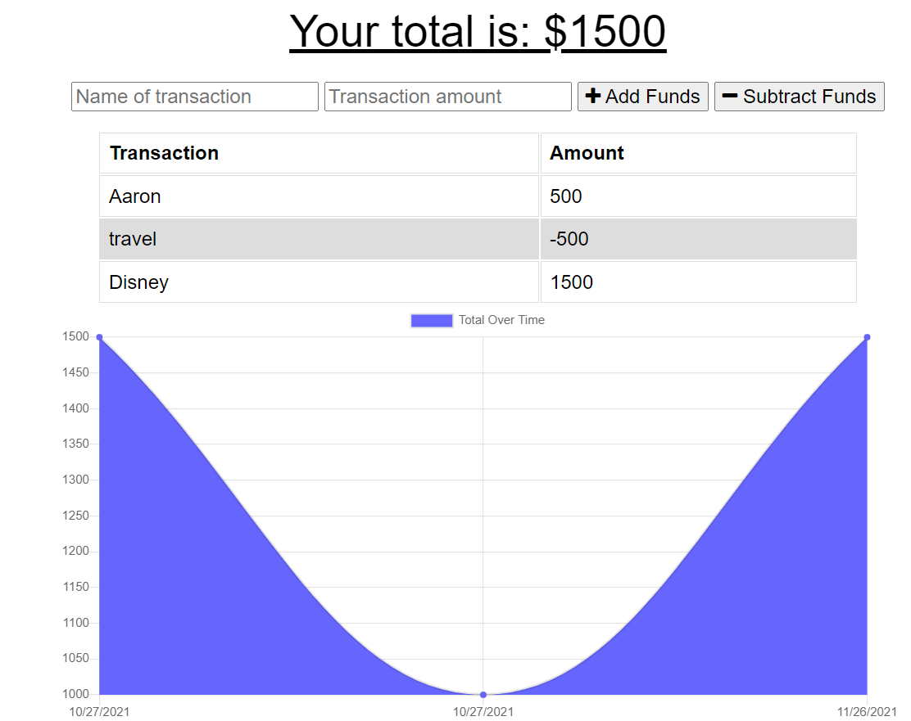

# Progressive Budget-Tracker

## Description
An offline available budget tracker
## Table of Contents
- [Installation](#installation)
- [Usage](#usage)
- [Contribution](#contribution)
- [License](#license)
- [Questions](#questions)
## Usage
- Add and subtract funds
- View chart with fund history
- Used both online and offline
Sceenshot of website:

## Installation
- Add files to local folder
- Make sure you have npm install
- Launch with node server.js

## Contribution
Github user Aaron8907
## License
The license is MIT License to see more information click on the badge at the top.
## Question
- Email: i.q.marquez@live.com
- GitHub: https://github.com/Aaron8907